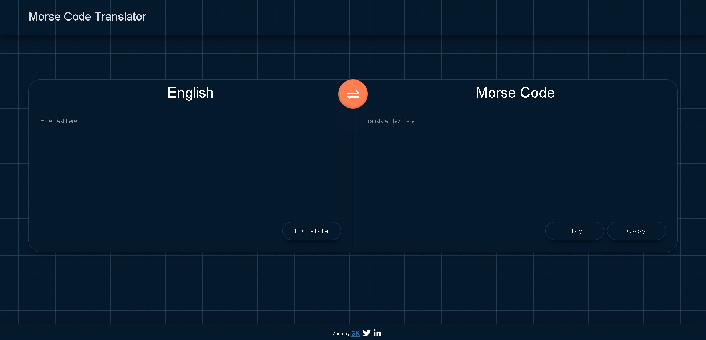

# Morse Code Text and Audio Translator App

Morse Code translator app is built using vanilla JavaScript. User can type in text in English and convert it to Morse Code in text or audio. Morse Code is a method to encode or represent letters of the alphabet, numerals, and punctuation marks by an arrangement of dots, dashes, and spaces. Morse code can be transmitted in a number of ways: originally as electrical pulses along a telegraph wire, but also as an audio tone. It currently uses the funtranslations Morse Code text and audio apis and is rate limited to 5/hour.

Hosted on Netlify.

## Installation

Clone the repository or download it as zip.

## Demo

Online demo available at [minionese](https://eng-morse.netlify.app/).
